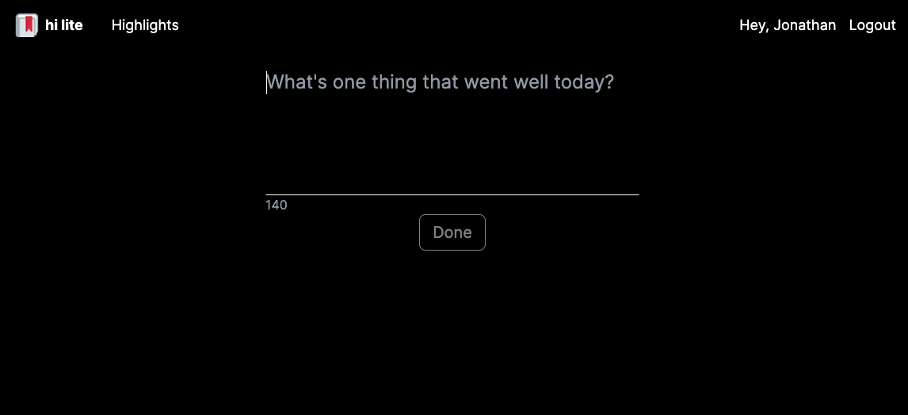
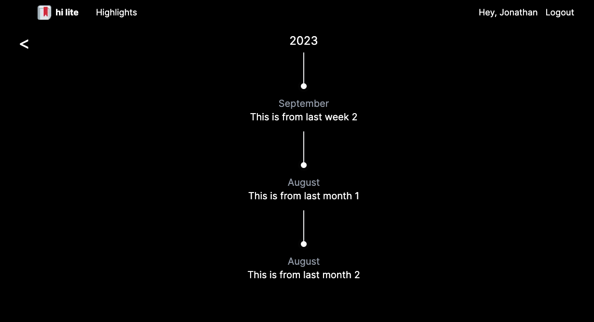
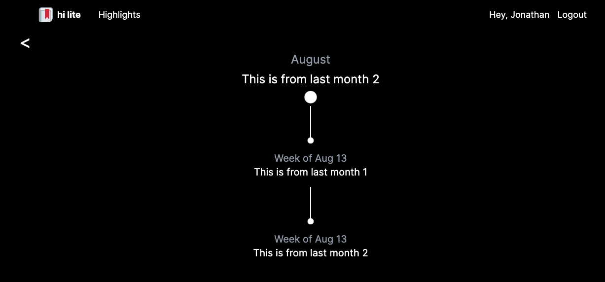

# 🔖 hi-lite

A web app designed to help bring more awareness to the best parts of your day. It works by collecting a quick text blurb about each highlight throughout your day, and at the end of the day, prompting you to select your favorite one. Then, at the end of every week, hi-lite will prompt you to select the highlight of your week from that week's daily highlights. Rinse and repeat for the month (from weekly highlights) and year (from monthly highlights). hi-lite will then store these memories in the highlights section, where you can drill down into each individual period of time to remember highlights!

The server for this app can be found [here](https://github.com/jn222/hi-lite-api).

## Demo

Client: https://hi-lite.vercel.app/

Server: https://hi-lite-api.onrender.com/

## Screenshots







## Tech Stack

**Client:** NextJS [(App Directory)](https://nextjs.org/docs/getting-started/project-structure), React, [TailwindCSS](https://tailwindcss.com/), [Zustand](https://github.com/pmndrs/zustand), Jest

[**Server:**](https://github.com/jn222/hi-lite) Node, Express, [Prisma](https://www.prisma.io/), Jest

**Database:** Postgresql

**Hosting:** [Vercel](https://vercel.com) for client and database, [Render](https://render.com/) for server

## Run Locally

Make sure to clone and set up the server and database for this project as well, more details can be found [here](https://github.com/jn222/hi-lite-api).

Clone the project

```bash
  git clone git@github.com:jn222/hi-lite.git
```

Go to the project directory

```bash
  cd hi-lite
```

Install dependencies

```bash
  yarn install
```

Start the app

```bash
  yarn dev
```

Start a production build

```bash
  yarn build
  yarn start
```

## Todos

- Put in tests 😭
- Figure out exit animations
- Make intro/about page to hide entry page if not logged in
- Make storybook work
- Centralize stylings

## Known bugs

- When there are skips in hierarchy, the highlights page sometimes is blank
